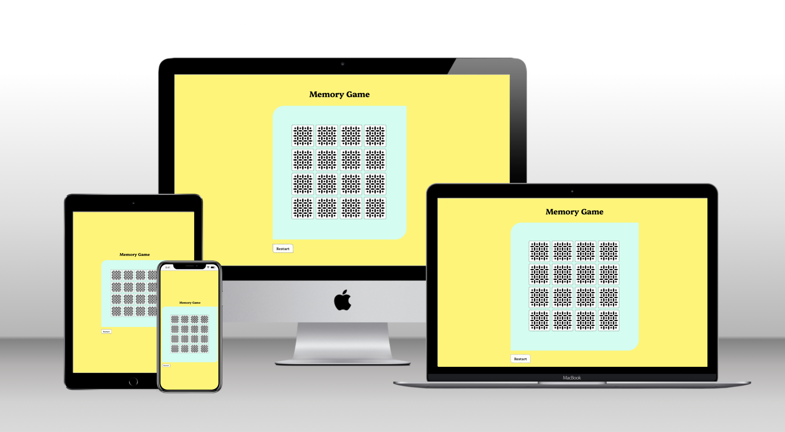
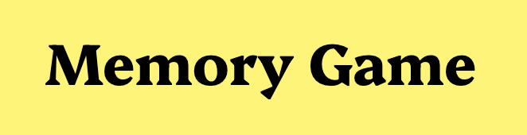
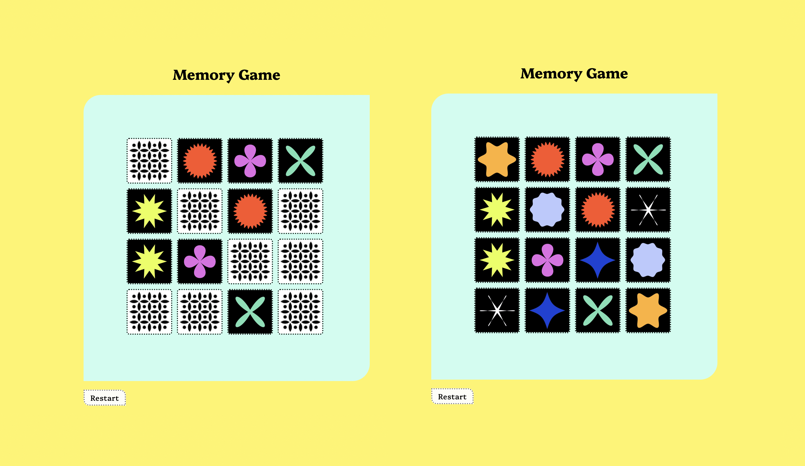

# Memory Game
## Game Overview

For my first **JavaScript** project I wanted to re-create the popular Memory Game we all know and love from childhood. It was a personal favourite of mine during my own childhood growing up in Germany. It’s a classic game that all people young and old have been been enjoying in its various iterations since the 16th century up until today. It possibly ows its longevity to its simple rules and instant engagement. 

The Memory Game was first published in today's form by Ravensburger, Germany in February 1959 who also hold the rights to the brand name "Memory".

Japanese versions known as Awase or Kai-awase date from the 16th century and feature matching pictures painted on shells.

In the USA and England the game was known as Pairs, Pelmanism, or Concentration whilst in Switzerland it was a domino-like game named Zwillingsspiel.

I liked the idea of taking this old-fashioned, globally popular game and making it available online. The mobile version allows you to play when out and about. 

### Website Link
[Memory Game](https://clemencehuang.github.io/memoryGame/)

&nbsp;

&nbsp;
***
&nbsp;

## Technology

-   **HTML** was used to define the structure and and define the JavaScript script area.
-   **JavaScript** was used to add functionality to the game.  
-   **CSS** was used to style the HTML elements.
-   **Git** was used as a version control software, utilizing the command line terminal to commit to Git and Push to GitHub.
-   **GitHub** is used as the hosting site to store the code for the website after being pushed from Git.
-   **Google Fonts** was used to import the "Platypi" font family.
-   **Google Chrome Developer Tools** was used during testing, debugging and making the website responsive.

## References
  
-  Online course material from the Code Institute to learn HTML and CSS alongside W3Schools, Stack Overflow, CodePen and YouTube.
-  I used the Mimo app as an additional learning path which helped with step-by-step practice and also offered snippets of new code that I hadn't picked up through the Code Institute modules.

&nbsp;
***
&nbsp;

## Design and Content Structure

### Design
All design elements were carefully considered to give a vintage feel to the game. The play area and arrangement of cards were intentionally kept simple and graphic to mimic a real life Memory Card game. Even though hosted online, the design deliberately stays away from a typical digital gaming look. 

The graphic patterns were chosen for their warm and colourful design, reminiscent of the 70s. I took particular inspiration from my own set of Memory Game cards that I still own today. They feel part of the same family of cards, yet have distinguishable shapes and colours that allow the user to memorise them quickly.  

### Font
"Platypi" was chosen as a font due to its playful vintage features, the bold serifs give it a fun character. 

### Color Scheme
Colours are bright, bold and fun, but have a warmth that remains sophisticated to appeal to any age group. 

### Play area
At the start of the game, the cards are already distributed in a 4x4 formation with the black and white back of the cards facing the user. Each card will turn over when clicked and reveal the front of the card with a colourful graphic pattern. A maximum of two cards can be clicked at any one time, if they match, the cards with the matching shape will stay open and the user can click on another set of cards. If they don’t match, they will turn over again, showing the back of the cards again. The game finishes as soon as all eight sets have been correctly matched and the game resets.

### Navigation

Navigation is intuitive without the need for lengthy instructions as it’s a well known game that are played by kids around the world. It simply features the name of the game at the top of the play area and a RESTART button which can be clicked should the user wishes to reset the game before it finishes. 

&nbsp;
***
&nbsp;

## Future Development 

* Add a countdown timer with a set time in which the game has to be completed. To make it more challenging it would be fun if the user could choose from a range of time limits, e.g. 2 minutes, 1.5 minutes, 1 minute, 30 seconds. 
* A stopwatch that counts exactly how long it takes the user to compete the game. 
* Allow multiple players to compete against each other whereby they enter have a username and a scorecard. 
* Allow users to extend the play area to more cards, e.g. 24, 32, 64. 
* Make it fully adaptable to the device dimensions no matter how many cards the play area contains. 

&nbsp;
***
&nbsp;

## Testing

-   The Website was tested on Google Chrome, using DevTools across various breakpoints for mobile, tablet, laptop and desktop.
-   All links were tested across all pages and device breakpoints.

&nbsp;
***
&nbsp;

## Deployment
The site was deployed on GitHub pages as follows:

1. From the project's [repository](https://github.com/clemencehuang/memoryGame.git), select the **Settings** tab.
2. From the left-hand menu, select the **Pages** tab.
3. Under the **Source** section, select the **Main** branch from the drop-down menu and click **Save**.
4. A message will be displayed to indicate a successful deployment to GitHub pages and provide the live link: [Memory Game](https://clemencehuang.github.io/memoryGame)

&nbsp;
***
&nbsp;

### Thank you for reading me!
